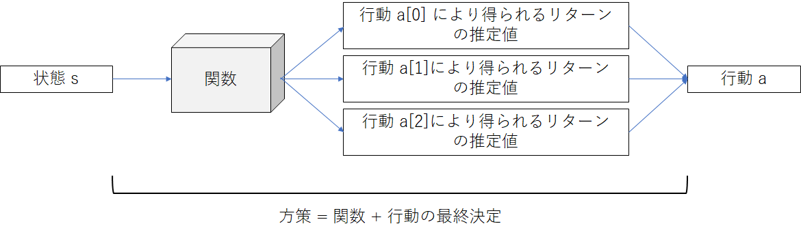
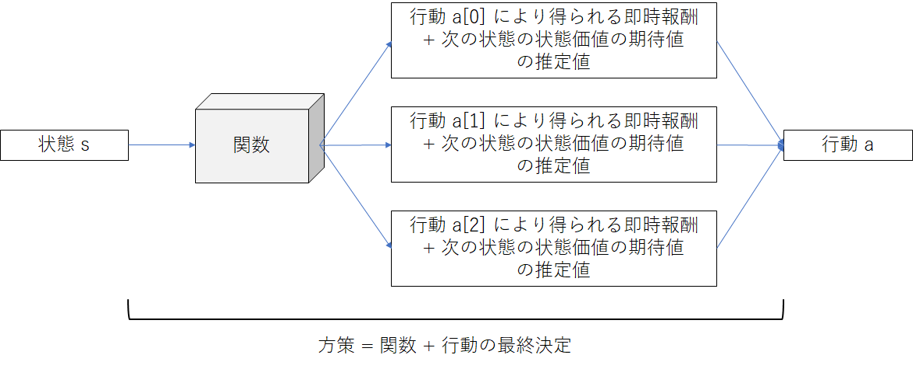
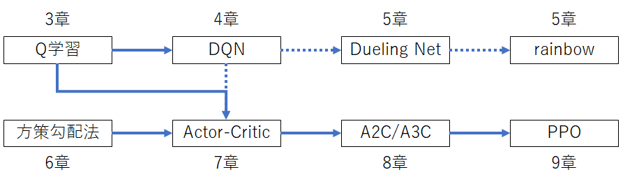
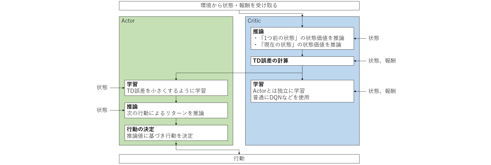

## 0. 前置き

### どんな資料か

- 強化学習の背景にある理論がなんとなくわかる
- 強化学習をこれから勉強していきたいときの指針になる
- この資料だけでなく、勉強になる強化学習関連の良記事を紹介する

### 対象者

- ディープラーニングを用いた教師あり学習が若干でもわかる
- 強化学習をやってみたい

### その他

建前：ガチで勉強したい人は専門書を読むのが良いと思うので

本音：ちゃんと理論までカバーするのはつらいので

⇒厳密性は廃して書きました

⇒頭を使わず何となくわかるようになっているはず

## 1. 強化学習とは

前置きです。強化学習あまりわからない、という人は読んでください。

### 1-1 強化学習を使うと何ができるのか

強化学習の用途がイメージできていない方は[この記事](https://ai-kenkyujo.com/2020/07/29/kyoukagakusyu/)の2章までを読んでください。

### 1-2 強化学習の定義

#### 1-2-1 エージェントと環境

- **エージェント**
  - 行動の主体
  - 取るべき行動を決定する**方策**を持つ
- **環境**
  - エージェントが存在する空間
  - 環境はエージェントを含む。つまり環境 = エージェントの周囲の環境 + エージェント

エージェントと環境の関係は、よくこんな感じで図解されます。（図は[ここ](http://takionaka.livedoor.blog/archives/4723105.html)のものを甲斐が勝手に編集したもの。社内向けなので許して）

#### 1-2-2 エージェントの機能

- **行動**
  - エージェントがエージェント自身や環境に影響を与える手段のこと
  - 環境から受け取った**状態**をもとに自らの取る**行動**を決定することができる
  - 可能な行動の集合（ようは行動の選択肢すべて）のことを**行動空間**と言う

- **方策**
  - ある**状態**においてどの**行動**をどの程度の確率で選択するかというエージェントの行動原則のこと

＜補足＞エージェントに実体がない場合（囲碁ゲームのAIなど）にはエージェントと方策は同一視できるので、その影響からか方策を指してエージェントという単語を使うことがあります。一般向けには問題ないですが、強化学習手法を語る場合はきちんと区別するのが無難でしょう。

#### 1-2-3 環境の機能

- **状態**（または**観測**とも）
  - 環境がエージェントに与える情報を指す
  - 環境内に存在する情報の全て、または一部を与える
- **報酬**
  - 環境がエージェントにフィードバックする情報のこと
  - エージェントの**行動**の結果を何らかの方法で評価する
    - この報酬をどのように設定するかも重要

### 1-3 強化学習の仕組み

#### 1-3-1 強化学習の立ち位置

強化学習は**優れた方策を得る**ための手段です。つまり、

- 目的：タスクに適合した優れたエージェントを作ること
  - 目標：状態に応じて、多くの報酬和を得られる行動を選択する方策を持つこと
    - 手段：強化学習

ということです。

#### 1-3-2 ステップ

強化学習は下図のようなサイクルで進行します。この1サイクルを**ステップ**と呼びます。

＜参考＞

[DQN（Deep Q Network）を理解したので、Gopherくんの図を使って説明](https://qiita.com/ishizakiiii/items/5eff79b59bce74fdca0d)（これまでの用語の説明がまとまっています）

#### 1-3-3 エピソード

ステップと似た概念に**エピソード**があります。エピソードとステップの関係を例で示すと、

- 例：迷路のゴールまで進む、というタスク
  - ステップ：1歩動くこと（+ その間に環境から状態と報酬を受け取り学習すること）
  - エピソード：スタート地点からゴール地点まで移動する一連のステップ

のようになります。あくまで環境との相互作用の基本単位はステップです。

学習は1ステップごとに行う場合と1エピソード終了したタイミングで行う場合があり、アルゴリズムによって向き不向きがあるので使い分けられています。

#### 1-3-4 報酬とリターン

行動の直後に得られる報酬だけを重視すると、長期的な成功につながる学習ができなくなってしまいます。長期的な学習をうまく行うために、ある行動の直後だけでなく、その後エピソード終了までにもらえた報酬を加味した概念である**リターン**を導入します。

- 即時報酬
  - 「現在の状態から次の状態へ」移行したときに得られる報酬
- 長期報酬
  - 即時報酬の対義語
  - 現在より先の時間で行動した時に得られる報酬のこと
- リターン（割引付き報酬和）
  - 「ある状態からある行動をした結果、エピソード終了までに得られる報酬の総和」の期待値
    - ただし、1ステップ後に行くたびに割引率γ（ガンマ）を乗算する
  - 即時報酬だけでなく長期報酬を考慮することができる
    - 長期報酬をどの程度重視するかは割引率γで調整可能（1：即時報酬と同等に評価する、0：長期報酬を評価しない）
  - **状態価値**を定義するのに使う
  - **方策勾配法**の学習にも使う

＜参考＞

- [趣味の強化学習入門](https://qiita.com/ikeyasu/items/67dcddce088849078b85#%E5%A0%B1%E9%85%AC)

### 1-4 ディープラーニングとの関連性

単に「強化学習」といった場合は慣例的に「ディープラーニングを用いた強化学習」を指すことも多いです。しかし、強化学習は必ずしもディープラーニングを用いるものではなく、ディープラーニングがメジャーになる前から使用されていました。後述する**Q学習**などはディープラーニングを用いなくても使える手法であり、現在でも強化学習のスタンダードな方法として紹介されることが多いです。

一方でディープラーニングが流行して以降、強化学習は急激な発展を見せました（2019年ころからは落ち着いていますが）。その理由は（甲斐の独自解釈ですが）次の2つです。

- Q学習の課題を解決するためにディープラーニングが有用であった
- 強化学習で用いる「方策を最適化するアルゴリズム」とディープラーニングとの親和性が凄まじかったため

### 1-5 教師あり学習・教師なし学習との関連性

よく「教師あり学習」「教師なし学習」と並立する第三の概念として解説されますが、無関係の技術と考えるほうが良いと思います。なぜなら、背景となる「古典的な」強化学習の手法が教師あり学習・教師なし学習とは全く異なるためです。

ただし、強化学習を学ぶ前に、**教師あり学習の知識は持っておくのが望ましい**です。なぜなら、強化学習で最適化することになる**方策** / **状態価値** / **行動価値** の学習にはいずれも教師あり学習とよく似た（同一視できるかも？）方法が使われるためです。特にディープラーニングを用いた場合のアルゴリズムは教師あり学習の理解が必要です。

### 1-6 表記

これまで定義した用語に対し、次のような表記を行うのが一般的です。

- 状態　s
- 行動　a
- 報酬　r

また、t 番目のステップを時間 t ということが一般的です。時間 t における上記3項目を下記のように表記します（本来 t は下付き文字）。

- 状態　st
- 行動　at
- 報酬　rt

## 2. 強化学習の種類

### 2-1 離散行動空間と連続行動空間

#### 2-1-1 離散行動空間

**離散行動空間**とは、その要素である行動が離散的（連続的でないこと）であるような行動空間を指します。離散行動空間を持つエージェントは、状態から各行動の評価値を計算し、評価値に基づき行動を選択します（分類問題のような要領です）。

離散行動空間の例として、下記のようなものがあります。

- cart-poleタスク：「右に行くか」「左に行くか」「静止するか」が行動の選択肢である
- 囲碁AI：「19×19マスのうち何処に石を置くか」が行動の選択肢である
- 後述する「連続行動空間」を離散化した場合

#### 2-1-2 連続行動空間

一方、**連続行動空間**とは、その要素である行動が連続的であるような行動空間を指します。連続行動空間を持つエージェントは、状態から行動（連続値）を直接計算し、行動します（回帰問題のような要領です）。

連続行動空間の例として、下記のようなものがあります。

- pendulumタスク：「左右にどれだけのトルクをかけるか」の連続値を行動とする
- ロボットの制御：「目標となるxyz座標」や「各関節の角度」や「各関節のトルク」のような連続値を行動とする
- その他、現実に存在する多くのタスク

#### 2-1-3 勉強のための指針

まずは連続行動空間のことは忘れて、**離散行動空間のみを考える**ことにします。なぜならば、最も初歩的なQ学習やSARSA以外の手法は基本的に離散行動空間と連続行動空間の両方に対応でき、かつ離散行動空間には下記のような利点があるためです。

- 離散行動空間のほうが問題が単純なものが多く、初学者に向く
- 学習の結果としてどのような行動を選択したか可視化しやすい
- ディープラーニングのような複雑な学習機を使わなくても可能

### 2-2 価値ベースと方策ベース

前述のとおり、離散行動空間を考えます。行動の選択肢が3個あり、この中から良い行動を選びたいと考えた場合、どのように決定しようとするでしょうか？

#### 2-2-1 方策ベース

1つの立場は、行動の選択肢ごとに**得られるリターンの推定値**を計算する、というものです。

この方法は**方策そのもの**にフォーカスし**方策勾配定理**というテクニックで学習していくため、**方策ベース**の方法と言われます。

#### 2-2-2 価値ベース

もう1つの立場では、**状態価値**（状態が持つ価値）を推論することによって間接的に行動を評価しよう、というものです。

この方法は**状態価値**にフォーカスしベルマン方程式というテクニックで学習していくため、**価値ベース**の方法と言われます。

#### 2-2-3 比較

方策ベースの手法も価値ベースの手法も、行動の選択肢ごとに何かの評価値を計算し最大のものを選ぶという点で似たような外見に落ち着きます。しかしその中身の考え方や計算方法、学習方法などは別物と考えて良いでしょう。

中身の異なる2つの手法ですが、それぞれに特有のメリットがあることから、どちらかが切り捨てられることなく、ほぼ並立した状態で研究が進められてきました。また、Actor-Criticと呼ばれる強化学習手法はこれら2つの方法を融合したものであり、こちらも優秀な結果を残しています。

|                       | 価値ベース | 方策ベース | Actor-Critic |
| --------------------- | ----- | ----- | ------------ |
| 行動の次元が小さい（Atariゲームなど） | ◎     | △     | 〇            |
| 行動の次元が大きい（ロボットの制御など）  | △     | 〇     | ◎            |

### 2-3 勉強のための指針

#### 2-3-1 強化学習手法マップ

こんな感じの枠組みで理解するとわかりやすいかと思います。なお、Actor-Criticは方策ベースの手法に価値ベースの方法を付け足したという意味合いが強いので、方策ベースの一種として整理しています。

＜参考＞

[深層強化学習アルゴリズムまとめ](https://qiita.com/shionhonda/items/ec05aade07b5bea78081#actor-critic%E7%B3%BB)（より詳しくはこちら）

#### 2-3-2 以降の構成

ズバリ、お勧めの手法は**PPOとA2C**です。その理由は大まかに言うと次のようになります。

- 様々なタスクで満遍なく成果を残している
- アルゴリズムが難しくない
- 並列化・高速化を必要としない（回避できる）ためPCに制約されない

この資料ではA2CとPPOの実装を目標として、その前提となる技術を紹介します。下図に以降の構成を示します。

- 3章：**基礎的な価値ベース手法**であるQ学習を解説します。同時に**状態価値**や**状態行動価値**、**TD学習**といった重要な概念も導入します。
- 4章：Q学習を拡張し、**NNを用いたQ学習**であるDQNを解説します。DQNは価値ベース手法の代表的なものです。
- 5章：**DQNを改良した手法**としてDueling Networkやrainbowを紹介します。また、8章のA2Cで重要になるAdvantage関数をこっそり導入します。
- 6章：**基礎的な方策ベース手法**である方策勾配法を解説します。
- 7章：**価値ベースと方策ベースの手法を併用**したActor-Criticを解説します。
- 8章：**Actor-Criticを改良した手法**であるA2CおよびA3Cを解説します。
- 9章：**A3Cを改良した手法**であるPPOを解説します。

＜参考＞

[最近強化学習の良記事がたくさん出てきたので勉強しながらまとめた](https://www.slideshare.net/k1ito/ss-123088713)（このドキュメントのストーリーに近いので見比べて頭の整理にでも）

### 3. Q学習

### 3-1 Q学習の特徴

#### 3-1-1 位置づけ

- ディープラーニング以前から使用されている強化学習手法
- **価値ベース**手法の一種
  - その中でも**TD学習**（⇒3-2-4項）という方法を拡張したもの

#### 3-1-2 利点・欠点

Q学習には単純ゆえに次のような利点・欠点があります。

| 特徴                                         | 利点                                     | 欠点                                                         |
| -------------------------------------------- | ---------------------------------------- | ------------------------------------------------------------ |
| 行動価値関数を表形式（行列・テンソル）で表す | ・行動価値関数を可視化しやすい           | ・メモリを食いやすい ・全条件を探索できるまでに莫大な試行回数が必要 |
| 簡単なタスクに向く                           | ・簡単なタスクでは早く収束することがある | ・難しいタスクではなかなか収束しない                         |
| ディープラーニングを用いない                 | ・マシンパワーが必要ない                 | ・画像などを入力にしにくい                                   |
| 離散行動空間を扱う                           | ・理解しやすい                           | ・現実の問題に適用することが難しい                           |

### 3-2 前提知識の紹介

ここではQ学習の前提となる知識を紹介していきます。この資料はぼんやりとしたまとめしか書いていません。各項ごとに参考資料として挙げた資料を順番に読んでいくと前提知識が得られるように作っていますので、そちらをメインに読んでください。

#### 3-2-1 状態価値

価値ベースの手法が「価値ベース」たる所以が**状態価値**の概念です。2-2節で述べた通り、価値ベースの手法では、次のような理念を数式化します。

- 行動ではなく状態が価値を持つ
  - 状態 s にあるときの状態価値 V を V(s) と表す
- 状態価値とは、その状態から行動を繰り返した場合のリターンの期待値である
- 行動は何らかの固定された方策に基づいて選択される。例えば、「可能な行動から一様ランダムに決定する」など。

＜参考＞

- [今さら聞けない強化学習（1）：状態価値関数とBellman方程式](<https://qiita.com/triwave33/items/5e13e03d4d76b71bc802>)（前半）

#### 3-2-2 状態価値に関するベルマン方程式

ベルマン方程式は**価値ベースの手法の基礎**となる式です。ただし、完璧に覚えている必要はなく、なんとなく存在を知っているくらいで問題ありません。

（状態価値に関する）ベルマン方程式の前提は「状態の持つ価値とは、その状態から行動を繰り返した場合のリターンの期待値である」（3-2-1項）という点です。これを定式化して変形することで、V(st) を V(st+1) と即時報酬を用いて漸化式のように表記できることを偉い人が発見しました。これがベルマン方程式です。

＜参考＞

- [今さら聞けない強化学習（1）：状態価値関数とBellman方程式](<https://qiita.com/triwave33/items/5e13e03d4d76b71bc802#%E4%BE%A1%E5%80%A4%E3%81%AE%E5%AE%9A%E9%87%8F%E5%8C%96>)（後半）

#### 3-2-3 TD学習

状態価値を理解すればTD学習が可能になります（いよいよ学習です）。TD学習では状態価値 V(s) を正しい方向に少しずつ更新していきます。

ここでベルマン方程式を応用します。ベルマン方程式は正しい V(st) とV(st+1) の組において成立する式であり、学習初期には成立しません。しかし、**V(st) をベルマン方程式から期待される値に少し近づける**という操作（**ベルマン更新**）を繰り返すことで V(st) が正しい値に収束することが示されています。

具体的に「V(st) をベルマン方程式から期待される値に少し近づける」とは、次のように行います。

- V(st+1) と即時報酬 γt からベルマン方程式による V(st) の値を計算
- 現在の V(st) の値をそれに近づけるよう更新

＜参考＞

- [今さら聞けない強化学習（9）: TD法の導出](<https://qiita.com/triwave33/items/277210c7be4e47c28565#td%E6%B3%95>)（後半部分のみ理解すればOKです）

#### 3-2-4 行動状態価値

より高度なアルゴリズムであるQ学習へステップアップするため、状態価値を拡張した**行動状態価値** Q(s, a) を導入します。

状態価値 V(s) が「状態 s から方策に基づいて行動を繰り返した場合のリターンの期待値」を表すのに対し、行動状態価値 Q(s, a) は「状態 s において行動 a を選択し、その後は方策に基づいて行動を繰り返した場合のリターンの期待値」を表します。

＜参考＞

- [今さら聞けない強化学習（3）：行動価値関数とBellman方程式](<https://qiita.com/triwave33/items/8966890701169f8cad47>)（前半）

#### 3-2-5 行動状態価値に関するベルマン方程式

行動状態価値 Q(s, a) には、「方策に基づいた場合に行動 a が選択される確率（よくπ(s, a)と書かれます）を用いて Q(s, a) をすべての行動 a について重み付き平均すると V(s)と等しくなる」という重要な性質があります。

これを3-2-3項のベルマン方程式に代入して変形することで、 Q(s, a) についても、Q(st, at) と Q(st+1, at+1) との関係を定式化することができます。詳細は参考資料に譲ります。

＜参考＞

- [今さら聞けない強化学習（3）：行動価値関数とBellman方程式](<https://qiita.com/triwave33/items/8966890701169f8cad47>)（後半）

### 3-3 Q学習のゴール

Q学習はその名の通り、行動状態価値 Q(s, a) を学習していく手法です。ここでは次の仮定をします。

- 状態 s は離散値、つまりいくつかある状態のうちの1つ、という状態を取る
  - また、このとき変数が1つしかないという意味で s は1次元である
- 行動 a は離散値、つまりいくつかある行動の選択肢から1つを選ぶ
  - また、このとき決定すべき a が1つしかない という意味で a は1次元である

このとき、Q(s, a) は単なる二次元の行列に数値が詰まったものであるといえます。つまり、この行列は**「状態 s において行動 a の結果得られるリターンの推定値」がわかる表**になっているということです（s や a が1次元でない場合はこの行列を3次元以上に拡大します）。この表の値を更新していくのがQ学習であり、学習が正しく行われれば、状態 s において最も多くのリターンが得られる行動を選ぶことができるはずです。

なお、「Q(s, a) を求めて a を選択する」という意思決定方法は、DQNなど他の価値ベースの手法でも（表ではなく関数という形式を用いるにせよ）共通です。

＜参考＞

[https://qiita.com/ishizakiiii/items/5eff79b59bce74fdca0d](https://qiita.com/ishizakiiii/items/5eff79b59bce74fdca0d)（1章で紹介した記事の再掲です）

[DQN(Deep Q-Network)とは？DQNを使って強化学習する方法を徹底解説](https://ai-kenkyujo.com/2020/05/18/deep-q-network/)（前半部分が表形式で価値を表す例としてわかりやすいです）

### 3-4 Q学習をしてみる

## 4. DQN

### 4-1 なぜDQNが必要か

#### 4-1-1 Q学習の欠点

実は、Q学習のままだと将来的にやりたいことがかなり制限されてきます（Q学習がタスクを解決する能力の高低はここでは議論しません）。実際にQ学習を行なってみて感じた欠点を（主観的に）下記にまとめます。

- s の次元（観測するパラメータの数）や a の次元（制御する行動の数）が大きくなると、行動状態価値 Q の表が莫大に大きくなるため、メモリを大量に使う

  - 例：

    - s：エージェントの位置（x方向, y方向, z方向の3次元をそれぞれ離散化したもの）、エージェントの速度（x方向, y方向, z方向の3次元をそれぞれ離散化したもの）の計6次元
    - a：加速する方向と加速度の大きさ（x方向, y方向, z方向の3次元をそれぞれ離散化したもの）の3次元

    ⇒それぞれ粗く10段階に離散化しただけで10^7個の要素を持つテンソルとなる

- 各状態に対する行動状態価値は、その状態を経験するまでわからない

  - 上記の例では最低でも10^7ステップを経験しないとどの状態が優れているかわからない
  - 本来、全く同じ状態でなくても、その行動状態価値はなんとなく推論できてほしい

- 離散的な状態しか扱うことができない

  - 本来、状態 s を連続値のまま使用しても、Q(s, a) は計算できてほしい

#### 4-1-2 DQNの利点

前項の問題は行動状態価値 Q をn次元の表として表現することがそもそもの原因であると言えます。そこで、行動状態価値を関数近似することでこの状況の打破を試みます。

そこで**DQN**（Deep Q Network）の出番です。DQNでは状態 s から Q(s, a) を計算するためにNNを使用します。これにより、前項とは対象的に下記の利点が得られます。

- s の次元（観測するパラメータの数）や a の次元（制御する行動の数）が大きくなっても、ネットワークの入力ノード数・出力ノード数が若干大きくなるだけで、メモリ消費があまり大きくならない

- 経験したことがない状態に対しても、類似する状態をとった経験から行動状態価値を推論することはできる（性格とは限らない）

- 状態が離散的な場合も連続的な場合も入力できる（連続的な方が扱いやすい）

また、NNを用いるのにも必然性があります。それは下記の点で他の学習器より優れているためです。

- ニューラルネットのパラメータ更新方法がベルマン更新とよく似ており、教師あり学習に似た方法で強化学習ができる

- 画像を状態として取得し、CNN（畳み込みNN）を用いてワンストップで行動状態価値を推論・学習できる（ただしこの場合はメモリをそれなりに使う）

### 4-2 DQNの学習

[DQN（Deep Q Network）を理解したので、Gopherくんの図を使って説明](https://qiita.com/ishizakiiii/items/5eff79b59bce74fdca0d#q-learning)

[作りながら学ぶ強化学習 -初歩からPyTorchによる深層強化学習まで（第14回）](https://book.mynavi.jp/manatee/detail/id=89691)

↑これらの資料を熟読してください。4-1節で説明したQ学習の課題とDQNの利点も復習がてら再確認してください。

ディープラーニングの心得がある人なら、Q学習の学習方法である「現在の値を推定値に近づける」 = 「現在の値と推定値との差を縮めるよう更新する」というアルゴリズムが、「NNの教師あり学習でいつもやっている方法」としてすんなり記述できることがわかると思います。素晴らしいご都合主義です。

結局、Q学習で「ベルマン方程式を用いてQ(s, a)を更新する」だった部分を「Q(s, a)をターゲットに近づける」に書き換えればDQNの学習ができます。そしてこの操作はPytorchやTensorflowで記述できます。

### 4-3 重要なDQNのテクニック

4-2節で紹介した2つの資料を参照し、下記のキーワードを理解してください。

- 【超重要】Experience Replay
  - なんならDeep使ったことよりもこの手法が偉大だったのが成功の要因だったまである

- 【超重要】Fixed Target Q-Network
  - 実はこれを使わないとうまく学習できない

- 【重要】報酬のclipping
  - 報酬の設計はいつでも重要

- 【微妙】Huber損失
  - 使わなくてもできるが、使ったほうが良い？

＜参考＞

[DQNの理論説明](https://www.renom.jp/ja/notebooks/tutorial/reinforcement_learning/DQN-theory/notebook.html)（こちらも丁寧でわかりやすいです）

### 4-4 DQNの実装例

## 5. DQNの改良

ここではDQNを改良した手法の中で優先して勉強しておくべき手法を2つ紹介します。

### 5-1 Dueling Net

行動価値関数 Q(s, a) を学習する代わりに V(s) と**アドバンテージ関数 A(s, a) **を学習する方法です。アドバンテージ関数は**A2Cにも応用**されている重要な考え方です。アドバンテージ関数は次のように定義されます。

A(s, a) = Q(s, a) - V(s)

Dueling Netでは、NNのアウトプットとして V(s) と A(s, a) を学習・推論することで、Q(s, a) を直接学習する場合と比較して次の2つのメリットがあります。

- V(s) の学習：「その状態にあること」の価値が、行動の良し悪しに左右されず学習できる
- A(s, a) の学習：「行動そのもの」の価値が、元の状態の良し悪しに左右されず学習できる

＜参考＞

・[論文紹介：Dueling network architectures for deep reinforcement learning](https://www.slideshare.net/KazukiAdachi/dueling-network-deep-reinforcement-learning)

・[Dueling Network Architectures for Deep Reinforcement Learningを読んだ](https://qiita.com/d-ogawa/items/08b90c09a0cdf13e8cbd)

・[論文](https://arxiv.org/pdf/1511.06581.pdf)

### 5-2 Rainbow

Dueling NetなどDQNの改良アイデア7つを全部盛りしたものです（Dueling Netは強力な手法なのですが、実はRainbowにおいてはあまり貢献していないらしいです）。価値ベースの手法の中では**簡単にできるわりに性能が良い**ので、方策ベースが向かないタスクがあれば（あまりないですが）これを使いましょう。

また、ベースとなる7つのアイデアが**重要かつ面白い**ものであるため、勉強するにもお勧めです。

＜参考＞

・[Rainbow（slide share）](https://www.slideshare.net/harmonylab/rainbow-104505808)

・[論文](https://arxiv.org/pdf/1710.02298.pdf)

## 6. 方策勾配法を利用した強化学習

### 6-1 方策勾配法の特徴

- ディープラーニング以前から使用されている強化学習手法
- **方策ベース**手法の一種
- 離散行動空間・連続行動空間のどちらも対応可

### 6-2 方策勾配定理

方策勾配法では**方策勾配定理**と呼ばれるテクニックを利用します。ここは頑張って理解しても介入できない部分なので、適当に流して次に進むのがおすすめです。

＜参考＞

[方策勾配型強化学習の基礎と応用（Slide Share）](https://www.slideshare.net/RyoIwaki/ss-87924430)

### 6-3 方策勾配法の学習

実用的には、方策関数の出力とリターンとの差異をTD誤差のように扱い、下記の式で方策関数を更新します（δがTD誤差）。

リターンは1エピソード終了後に、実際に得られた報酬を用いて計算します。したがって、方策勾配法では1エピソード終了したタイミングで学習を行うことが一般的です。

この式の解釈の1つは、**リターンの予測値とリターンとの差が小さくなる方向に方策関数のパラメータを修正する**ことにより学習が可能である、ということです（上記の式における4行目）。結局、発想や根拠とする式は全く異なるのに、**方策関数をNNとし、得られたリターンをターゲットとしてNNを学習する**というDQNのときと似た方法で学習を行います。

### 6-4 方策勾配法の実装例

## 7. Actor-Critic

### 7-1 なぜActor-Criticが必要か

#### 7-1-1 方策勾配法の欠点

6-3節で述べたように、方策勾配法は「そのエピソードで得たリターン」をターゲットとして方策関数を学習します。しかしここで得られるリターンは、「時間 t において、ある状態 st である行動 at をすること」のみではなく、「時間 t より後の行動」にも大きく影響されます。つまり、仮に同じ状態で同じ行動をとったとしても、NNのターゲットとして与えられる**リターンが大きくブレる**ことがあります。

＜補足＞**致命的な欠点ではない**らしく、方策勾配法で解決されている問題も多くあります。

#### 7-1-2 Actor-Criticの利点

そこでActor-Criticでは、価値ベースの方法で登場した**状態価値**を利用します。方策勾配法では「方策関数の出力とリターンとの差異をTD誤差のように扱う」ことがアルゴリズムのバックグラウンドになっているのに対し、Actor-Criticでは状態価値と即時報酬を用いてTD誤差を計算します。これにより、時間 t における行動が、時間 t より後の行動に依存せずに評価できることになります。

ただし、前提として行動の評価に用いる状態価値がある程度正しいことが求められます。状態価値はDQNのような価値ベースの手法によって学習します。

＜参考＞

[強化学習の基礎](http://www.jnns.org/previous/niss/2000/text/koike2.pdf)

[Actor-Criticによるロボットの強化学習](http://www.st.nanzan-u.ac.jp/info/gr-thesis/ms/2008/05mm029.pdf)

### 7-2 Actor-Criticの概要

ここでActor-Criticの仕組みについて整理します。

- Actor-Criticは**方策ベース**の手法を改良した手法である。
  - 方策関数を用いて、行動によって得られるリターンの期待値を計算する。
  - 方策関数の学習には方策勾配法を用いる。
  - この「行動によって得られるリターンの期待値を学習・推論する」関数を**Actor**と呼ぶ。
- 方策勾配法の欠点を補うため、TD誤差を状態価値を用いて計算する。
  - Actorの学習とは独立に、**価値ベース**の手法で状態価値を学習・推論する。
  - この「状態価値を学習・推論する」関数を**Critic**と呼ぶ。

Actor-Criticに関するネットの記事は「ごちゃごちゃした」図解が多かったので、フローチャートを置いておきます。

＜補足＞学習のタイミングは1ステップごとでなく1エピソードごととする場合が多いです。その場合、このフローチャートから「学習」が消えます。

### 7-3 Actor-Criticの実装例

## 8. A2C

### 8-1 概要

#### 8-1-1 Advantageの導入

A2Cは**Advantage Actor-Critic**の略であり、その名の通りAdvantage関数を用います。具体的には、

- Criticは状態価値を推論する（Actor-Criticと同様）
- 状態価値と報酬を用いてAdvantageを近似する（Actor-Criticからの変更点①）
  - 定義によっては1ステップ以上後の報酬も利用できる
- TD誤差ではなく代わりにAdvantageをターゲットとしてActorを学習（Actor-Criticからの変更点②）

これにより、TD誤差を使うより効率よく学習ができるとされています。

＜参考文献＞

[強化学習](http://yagami12.hatenablog.com/entry/2019/02/22/210608)

#### 8-1-2 同期分散

A2C（およびその先駆者であったA3C）登場以前の方策ベースの手法では、「そのエピソードで経験したこと」をエピソード終了後にまとめて学習することが一般的でした。この方法の欠点は、学習の際の1バッチに相関の高いデータが複数登場する（要は「似たようなシーン」ばかり登場する）ことでした。また、（理由は定かではないですが）方策ベースの手法はExperience Replayと相性が悪いとされており、それが使えなかったのがこの問題を助長していました。

A2C（およびその先駆者であったA3C）では、**複数のエピソードを並行して試行し、それらから経験を集約して学習する**（分散）という方法をとりました。この際、エピソード間で相関が高くならないよう、各エピソードの初期状態を一定にしないよう工夫をしました。結果、分散手法を使うことでActor-Criticより高い性能を発揮することができました。

＜補足＞A2CとA3Cの違いは、並行する各エピソードを同期するかです。

| A3C                                                          | A2C                                                |
| ------------------------------------------------------------ | -------------------------------------------------- |
| 複数のスレッドでアクターを動かしに経験を集める               | 複数のスレッドでアクターを動かしに経験を集める     |
| 各アクターから経験を順次集約し、一定数が集まるたびにネットワークを更新する | 各エピソードの終了を待ってネットワークを更新する。 |
| GPUと相性が良い                                              | マルチコアのCPUと相性が良い                        |
| コーディングが難しい                                         | コーディングはやや簡単                             |
| A2Cより性能で劣る場面が多い                                  | A3Cより性能が良い場面が多い                        |

### 8-2 利点と欠点

- 利点
  - とにかく学習が安定しやすい
  - 方策勾配法の欠点としてよく挙げられる「局所解に落ちると抜け出しにくい」をある程度緩和できる
- 欠点
  - 正しく実装しするためには、分散処理をきちんと記述する必要があるが……
    - 回避手段はある
  - 使いこなすためには、分散処理に向いたPCが必要があるが……
    - 回避手段はある

### 8-3 実装

A2Cは別に分散処理を書かなくても学習自体は可能です。要は、**複数エピソードを学習せずに走らせ、その後まとめて学習すれば良い**のです。ただしActorを更新する頻度が少なくなるので、シミュレーションに時間がかかるタスクでは効率が悪い方法となります。

## 9. PPO

### 9-1 概要

PPO（およびその先駆者であったTRPO）は方策勾配法の問題点であった（と表現されることが多いがおそらく価値ベースの方法でも問題である）、**学習の途中でパラメータが稀に非常に大きく更新される**ことで学習器が急激に悪化してしまう点を解決するための方法です。具体的には、**パラメータの変更をクリッピング**してしまうという方法をとります。PPOはA3C（A2Cの元ネタ）に適用され、A3Cより性能をやや改善しています。

A2CとPPOとの選択は微妙です。タスクによって優劣が分かれ、**使ってみるまでどちらが優れているかわからない**というのが現状です。学習させたいタスクに対し両方を試してみて、比較するのが望ましいと思います。

＜補足＞TRPOという方法を改良したものがPPOです。

| TRPO                                 | PPO                                |
| ------------------------------------ | ---------------------------------- |
| パラメータの更新にペナルティをかける | パラメータの更新をクリッピングする |
| 理論もコーディングも複雑             | 理論もコーディングも単純           |
| Actor-Criticに適用できない（らしい） | Actor-Criticに適用できる           |

### 9-2 実装

**a**