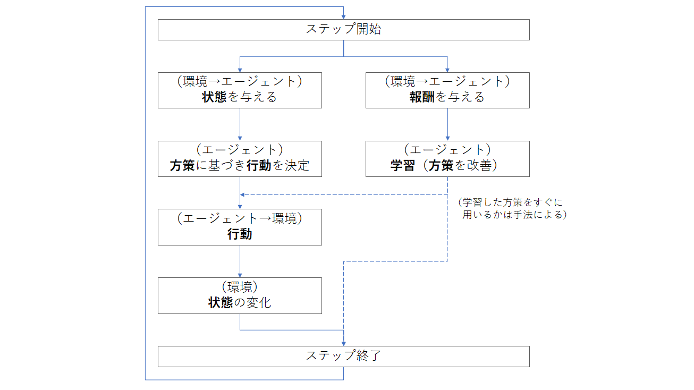

## 0. 前置き

### どんな資料か

- 強化学習の背景にある理論がなんとなくわかる
- 強化学習をこれから勉強していきたいときの指針になる
- この資料だけでなく、勉強になる強化学習関連の良記事を紹介する

### 対象者

- ディープラーニングを用いた教師あり学習が若干でもわかる
- 強化学習をやってみたい

### その他

建前：ガチで勉強したい人は専門書を読むのが良いと思うので

本音：ちゃんと理論までカバーするのはつらいので

⇒厳密性は廃して書きました

⇒頭を使わず何となくわかるようになっているはず

## 1. 強化学習とは

前置きです。強化学習あまりわからない、という人は読んでください。

### 1-1 強化学習を使うと何ができるのか

強化学習の用途がイメージできていない方は[この記事](https://ai-kenkyujo.com/2020/07/29/kyoukagakusyu/)の2章までを読んでください。

### 1-2 強化学習の定義

#### 1-2-1 エージェントと環境

- **エージェント**
  - 行動の主体
  - 取るべき行動を決定する**方策**を持つ
- **環境**
  - エージェントが存在する空間
  - 環境はエージェントを含む。つまり環境 = エージェントの周囲の環境 + エージェント

エージェントと環境の関係は、よくこんな感じで図解されます。（図は[ここ](http://takionaka.livedoor.blog/archives/4723105.html)のものを甲斐が勝手に編集したもの）

#### 1-2-2 エージェントの機能

- **行動**
  - エージェントがエージェント自身や環境に影響を与える手段のこと
  - 環境から受け取った**状態**をもとに自らの取る**行動**を決定することができる
  - 可能な行動の集合（ようは行動の選択肢すべて）のことを**行動空間**と言う

- **方策**
  - ある**状態**においてどの**行動**をどの程度の確率で選択するかというエージェントの行動原則のこと

＜補足＞エージェントに実体がない場合（囲碁ゲームのAIなど）にはエージェントと方策は同一視できるので、その影響からか方策を指してエージェントという単語を使うことがあります。一般向けには問題ないですが、強化学習手法を語る場合はきちんと区別するのが無難でしょう。

#### 1-2-3 環境の機能

- **状態**（または**観測**とも）
  - 環境がエージェントに与える情報を指す
  - 環境内に存在する情報の全て、または一部を与える
- **報酬**
  - 環境がエージェントにフィードバックする情報のこと
  - エージェントの**行動**の結果を何らかの方法で評価する
    - この報酬をどのように設定するかも重要

### 1-3 強化学習の仕組み

#### 1-3-1 強化学習の立ち位置

強化学習は**優れた方策を得る**ための手段です。つまり、

- 目的：タスクに適合した優れたエージェントを作ること
  - 目標：状態に応じて、多くの報酬を得られる行動を選択する方策を持つこと
    - 手段：強化学習

ということです。

#### 1-3-2 ステップ

強化学習は下図のようなサイクルで進行します。この1サイクルを**ステップ**と呼びます。

＜参考＞

[DQN（Deep Q Network）を理解したので、Gopherくんの図を使って説明](https://qiita.com/ishizakiiii/items/5eff79b59bce74fdca0d)（これまでの用語の説明がまとまっています）

#### 1-3-3 エピソード

ステップと似た概念に**エピソード**があります。エピソードとステップの関係を例で示すと、

- 例：迷路のゴールまで進む、というタスク
  - ステップ：1歩動くこと（+ その間に環境から状態と報酬を受け取り学習すること）
  - エピソード：スタート地点からゴール地点まで移動する一連のステップ

のようになります。あくまで環境との相互作用の基本単位はステップです。

学習は1ステップごとに行う場合と1エピソード終了したタイミングで行う場合があり、アルゴリズムによって向き不向きがあるので使い分けられています。

### 1-4 ディープラーニングとの関連性

単に「強化学習」といった場合は慣例的に「ディープラーニングを用いた強化学習」を指すことも多いです。しかし、強化学習は必ずしもディープラーニングを用いるものではなく、ディープラーニングがメジャーになる前から使用されていました。後述する**Q学習**などはディープラーニングを用いなくても使える手法であり、現在でも強化学習のスタンダードな方法として紹介されることが多いです。

一方でディープラーニングが流行して以降、強化学習は急激な発展を見せました（2019年ころからは落ち着いていますが）。その理由は（甲斐の独自解釈ですが）次の2つです。

- Q学習の課題を解決するためにディープラーニングが有用であった
- 強化学習で用いる「方策を最適化するアルゴリズム」とディープラーニングとの親和性が凄まじかったため

### 1-5 教師あり学習・教師なし学習との関連性

よく「教師あり学習」「教師なし学習」と並立する第三の概念として解説されますが、無関係の技術と考えるほうが良いと思います。なぜなら、背景となる「古典的な」強化学習の手法が教師あり学習・教師なし学習とは全く異なるためです。

ただし、強化学習を学ぶ前に、**教師あり学習の知識は持っておくのが望ましい**です。なぜなら、強化学習で最適化することになる**方策** / **状態価値** / **行動価値** の学習にはいずれも教師あり学習とよく似た（同一視できるかも？）方法が使われるためです。特にディープラーニングを用いた場合のアルゴリズムは教師あり学習の理解が必要です。

### 1-6 表記

これまで定義した用語に対し、次のような表記を行うのが一般的です。

- 状態　s
- 行動　a
- 報酬　r

また、t 番目のステップを時間 t ということが一般的です。時間 t における上記3項目を下記のように表記します（本来 t は下付き文字）。

- 状態　st
- 行動　at
- 報酬　rt

## 2. 強化学習の種類

### 2-1 離散行動空間と連続行動空間

#### 2-1-1 離散行動空間

**離散行動空間**とは、その要素である行動が離散的（連続的でないこと）であるような行動空間を指します。離散行動空間を持つエージェントは、状態から各行動の評価値を計算し、評価値に基づき行動を選択します（分類問題のような要領です）。

離散行動空間の例として、下記のようなものがあります。

- cart-poleタスク：「右に行くか」「左に行くか」「静止するか」が行動の選択肢である
- 囲碁AI：「19×19マスのうち何処に石を置くか」が行動の選択肢である
- 後述する「連続行動空間」を離散化した場合

#### 2-1-2 連続行動空間

一方、**連続行動空間**とは、その要素である行動が連続的であるような行動空間を指します。連続行動空間を持つエージェントは、状態から行動（連続値）を直接計算し、行動します（回帰問題のような要領です）。

連続行動空間の例として、下記のようなものがあります。

- pendulumタスク：「左右にどれだけのトルクをかけるか」の連続値を行動とする
- ロボットの制御：「目標となるxyz座標」や「各関節の角度」や「各関節のトルク」のような連続値を行動とする
- その他、現実に存在する多くのタスク

#### 2-1-3 勉強のための指針

まずは連続行動空間のことは忘れて、**離散行動空間のみを考える**ことにします。なぜならば、最も初歩的なQ学習やSARSA以外の手法は基本的に離散行動空間と連続行動空間の両方に対応でき、かつ離散行動空間には下記のような利点があるためです。

- 離散行動空間のほうが問題が単純なものが多く、初学者に向く
- 学習の結果としてどのような行動を選択したか可視化しやすい
- ディープラーニングのような複雑な学習機を使わなくても可能

### 2-2 価値ベースと方策ベース

前述のとおり、離散行動空間を考えます。行動の選択肢が10個あり、この中から良い行動を選びたいと考えた場合、どのように決定しようとするでしょうか？

#### 2-2-1 方策ベース

1つの立場は、行動の選択肢ごとに「どの程度の報酬が得られそうか」を計算し、最も得られる報酬の大きそうなものを選ぶというものです。この方法は行動を選択する方策にフォーカスを当てた方法であるため、**方策ベース**の方法と言われます。

#### 2-2-2 価値ベース

もう1つの立場は、行動ではなく状態が評価値（**状態価値**と言います）を持ち、各行動の結果として得られる「次の状態の状態価値」と「即座に得られる報酬」の和が最も大きくなるような行動を選ぶというものです。この方法は状態価値にフォーカスを当てた方法であるため、**価値ベース**の方法と言われます。

＜補足＞「次の状態の価値」は行動してみないとわからない、と言いたいところなのですが、**行動状態価値**と**ベルマン方程式**の導入によって解決します。行動状態価値は、ある状態においてある行動をとった場合の「次の状態の状態価値の期待値」を表し、その最大値（行動に関する最大値）が状態価値であると定義します。ベルマン方程式は現在の状態価値と次の時間での状態価値を結びつけた式です。この2つを組み合わせて式展開することで、「現在ある行動をとった場合の、次の時間の行動状態価値」が「現在の行動状態価値」から計算できてしまうことが示されているのです。行動状態価値は**とても頭の良い人がとても都合の良いように定義してくれた**ので、この議論は結局、前述の『「次の状態の状態価値」と「即座に得られる報酬」の和』を最大にするためには行動状態価値を最大にする行動を選択すればよい、という結論に着地します（この辺はちゃんと式を見たほうがわかりやすいです）。

#### 2-2-3 比較

方策ベースの手法も価値ベースの手法も、行動の選択肢ごとに何かの評価値を計算し最大のものを選ぶという点で似たような外見に落ち着きます。しかしその中身の考え方や計算方法、学習方法などは別物と考えて良いでしょう。

中身の異なる2つの手法ですが、それぞれに特有のメリットがあることから、どちらかが切り捨てられることなく、ほぼ並立した状態で研究が進められてきました。また、Actor-Criticと呼ばれる強化学習手法はこれら2つの方法を融合したものであり、こちらも優秀な結果を残しています。

|                       | 価値ベース | 方策ベース | Actor-Critic |
| --------------------- | ----- | ----- | ------------ |
| 行動の次元が小さい（Atariゲームなど） | ◎     | △     | 〇            |
| 行動の次元が大きい（ロボットの制御など）  | △     | 〇     | ◎            |

### 2-3 勉強のための指針

#### 2-3-1 強化学習手法マップ

こんな感じの枠組みで理解するとわかりやすいかと思います。なお、Actor-Criticは方策ベースの手法に価値ベースの方法を付け足したという意味合いが強いので、方策ベースの一種として整理しています。

＜参考＞

[深層強化学習アルゴリズムまとめ](https://qiita.com/shionhonda/items/ec05aade07b5bea78081#actor-critic%E7%B3%BB)（より詳しくはこちら）

#### 2-3-2 ひとまずの目標

ズバリ、お勧めの手法は**PPOとA2C**です。その理由は大まかに言うと次のようになります。

- 様々なタスクで満遍なく成果を残している
- アルゴリズムが難しくない
- 並列化・高速化を必要としないためPCに制約されない

この資料でもPPOとA2Cの実装を最終目標として、関連する技術を紹介します（大まかな関連性は2-3-1項の図を参照）。その中でも最初に勉強すべきものとして、まずは次章で**Q学習**を紹介します。

### 3. Q学習

### 3-1 Q学習の特徴

改めてQ学習の特徴を整理すると下記のようになります。

- ディープラーニング以前から使用されている強化学習手法
- **価値ベース**手法の一種
  - その中でも**TD学習**（⇒3-2-4項）という方法を拡張したもの
- **方策オフ**の手法（⇒？？？項）
- **離散行動空間**のタスクしか解けない

Q学習には単純ゆえに次のような利点・欠点があります。

- 利点

  - 行動価値関数が「表」「行列」「テンソル」のような形で表されるため、行動価値が更新されていく様子が簡単に理解できる
  - 価値ベースの手法の学習の基本である**ベルマン更新**（⇒3-2-3項）の式をそのまま用いるため、入門用に良い（わかりやすいとは言ってない）

  - cart-poleのような程度の簡単なタスクなら、下手にDQNなどを使うより早く収束することがあるうえ、マシンパワーが必要ない

- 欠点

  - 行動価値関数を「表」「行列」「テンソル」のような形で保持するため、状態や行動空間が複雑になるほど不利
    - メモリを食うため
    - 全条件を探索できるまでに莫大な試行回数が必要
  - ディープラーニングの恩恵を受けられない
  - 離散行動空間のタスクしか解けない

### 3-2 前提知識の紹介

ここではQ学習の前提となる知識を紹介していきます。この資料はぼんやりとしたまとめしか書いていません。各項ごとに参考資料として挙げた資料を順番に読んでいくと前提知識が得られるように作っていますので、そちらをメインに読んでください。

#### 3-2-1 報酬とリターン

- 即時報酬
  - 「現在の状態から次の状態へ」移行したときに得られる報酬
- 長期報酬
  - 即時報酬の対義語
  - 現在より先の時間で行動した時に得られる報酬のこと
- リターン（割引付き報酬和）
  - 「ある状態からある行動をした結果、エピソード終了までに得られる報酬の総和」の期待値
    - ただし、1ステップ後に行くたびに割引率γ（ガンマ）を乗算する
  - 即時報酬だけでなく長期報酬を考慮することができる
    - 長期報酬をどの程度重視するかは割引率γで調整可能（1：即時報酬と同等に評価する、0：長期報酬を評価しない）
  - 次項の**状態価値**を議論するうえで重要

＜参考＞

- [趣味の強化学習入門](https://qiita.com/ikeyasu/items/67dcddce088849078b85#%E5%A0%B1%E9%85%AC)

#### 3-2-2 状態価値

価値ベースの手法が「価値ベース」たる所以が**状態価値**の概念です。2-2節で述べた通り、価値ベースの手法では、次のような理念を数式化します。

- 行動ではなく状態が価値を持つ
  - 状態 s にあるときの状態価値 V を V(s) と表す
- 状態価値とは、その状態から行動を繰り返した場合のリターンの期待値である
- 行動は何らかの固定された方策に基づいて選択される。例えば、「可能な行動から一様ランダムに決定する」など。

＜参考＞

- [今さら聞けない強化学習（1）：状態価値関数とBellman方程式](<https://qiita.com/triwave33/items/5e13e03d4d76b71bc802>)（前半）

#### 3-2-3 状態価値に関するベルマン方程式

ベルマン方程式は**価値ベースの手法の基礎**となる式です。ただし、完璧に覚えている必要はなく、なんとなく存在を知っているくらいで問題ありません。

（状態価値に関する）ベルマン方程式の前提は「状態の持つ価値とは、その状態から行動を繰り返した場合のリターンの期待値である」（3-2-1項）という点です。これを定式化して変形することで、V(st) を V(st+1) と即時報酬を用いて漸化式のように表記できることを偉い人が発見しました。これがベルマン方程式です。

＜参考＞

- [今さら聞けない強化学習（1）：状態価値関数とBellman方程式](<https://qiita.com/triwave33/items/5e13e03d4d76b71bc802#%E4%BE%A1%E5%80%A4%E3%81%AE%E5%AE%9A%E9%87%8F%E5%8C%96>)（後半）

#### 3-2-4 TD学習

状態価値を理解すればTD学習が可能になります（いよいよ学習です）。学習というだけあって、TD学習では初めから正しい V(s) が推定できることを期待しません。代わりに、V(s) を正しいと思われる方向に少しずつ更新していくことで、何度もエピソードを繰り返すうちに正しい V(s) に近い値が得られることを期待します。

ここでベルマン方程式を応用します。ベルマン方程式は正しい V(st) とV(st+1) の組において成立する式であり、当然学習初期には成立しません。しかし、V(st) をベルマン方程式から期待される値に近づくように更新していくことで、徐々に正しい値に近づけるという操作により、V(st) が正しい値に収束するよう学習できるということが示されています。この操作を**ベルマン更新**と言います。

ベルマン更新では、V(st+1) と即時報酬 γt からベルマン方程式を成立させるような V(st) の値を計算し、元々の V(st) の値が少しだけそれに近づくように更新します。各ステップごとにベルマン更新を行い V を更新していく学習方法をTD学習とよびます。

＜参考＞

- [今さら聞けない強化学習（9）: TD法の導出](<https://qiita.com/triwave33/items/277210c7be4e47c28565#td%E6%B3%95>)（後半部分のみ理解すればOKです）

#### 3-2-5 行動状態価値

より高度なアルゴリズムであるQ学習、DQNへとステップアップしていくために、状態価値を拡張した**行動状態価値** Q(s, a) を導入します。

状態価値 V(s) が「状態 s から方策に基づいて行動を繰り返した場合のリターンの期待値」を表すのに対し、行動状態価値 Q(s, a) は「状態 s において行動 a を選択し、その後は方策に基づいて行動を繰り返した場合のリターンの期待値」を表します。

＜参考＞

- [今さら聞けない強化学習（3）：行動価値関数とBellman方程式](<https://qiita.com/triwave33/items/8966890701169f8cad47>)（前半）

#### 3-2-6 行動状態価値に関するベルマン方程式

行動状態価値 Q(s, a) には、「方策に基づいた場合に行動 a が選択される確率（よくπ(s, a)と書かれます）を用いて Q(s, a) をすべての行動 a について重み付き平均すると V(s)と等しくなる」という重要な性質があります。

これを3-2-3項のベルマン方程式に代入して変形することで、 Q(s, a) についても、Q(st, at) と Q(st+1, at+1) との関係を定式化することができます。

＜参考＞

- [今さら聞けない強化学習（3）：行動価値関数とBellman方程式](<https://qiita.com/triwave33/items/8966890701169f8cad47>)（後半）

### 3-3 Q学習のゴール

Q学習はその名の通り、行動状態価値 Q(s, a) を学習していく手法です。ここでは次の仮定をします。

- 状態 s は離散値、つまりいくつかある状態のうちの1つ、という状態を取る
  - また、このとき変数が1つしかないという意味で s は1次元である
- 行動 a は離散値、つまりいくつかある行動の選択肢から1つを選ぶ
  - また、このとき決定すべき a が1つしかない という意味で a は1次元である

このとき、Q(s, a) は単なる二次元の行列に数値が詰まったものであるといえます。つまり、この行列は**「s のとき a したら報酬の総和は推定これくらいだよ」ということがわかる表**になっているということです（s や a が1次元でないタスクの場合もこの行列を高次元に拡大するだけです）。これを学習によって得ることができれば、ある状態 s において最も多くのリターンが得られそうな行動を選び続けることができます。これを得るのがQ学習の目的です。

なお、「Q(s, a) を求めて a を選択する」という意思決定方法は、DQNなど他の価値ベースの手法でも（表ではなく関数という形式を用いる場合がほとんどですが）共通です。

＜参考＞

[https://qiita.com/ishizakiiii/items/5eff79b59bce74fdca0d](https://qiita.com/ishizakiiii/items/5eff79b59bce74fdca0d)（1章で紹介した記事の再掲です）

[DQN(Deep Q-Network)とは？DQNを使って強化学習する方法を徹底解説](https://ai-kenkyujo.com/2020/05/18/deep-q-network/)（前半部分が表形式で価値を表す例としてわかりやすいです）

### 3-4 Q学習をしてみる

## 4. DQN

### 4-1 なぜDQNが必要か

#### 4-1-1 Q学習の欠点

実は、Q学習のままだと将来的にやりたいことがかなり制限されてきます（Q学習がタスクを解決する能力の高低はここでは関係ないです）。実際にQ学習を行なってみて感じた欠点を（主観的に）下記にまとめます。

- s の次元（観測するパラメータの数）や a の次元（制御する行動の数）が大きくなると、行動状態価値 Q の表が莫大に大きくなるため、メモリを大量に使う

  - 例：

    - s：エージェントの位置（x方向, y方向, z方向の3次元をそれぞれ離散化したもの）、エージェントの速度（x方向, y方向, z方向の3次元をそれぞれ離散化したもの）の計6次元
    - a：加速する方向と加速度の大きさ（x方向, y方向, z方向の3次元をそれぞれ離散化したもの）の3次元

    →→それぞれ粗く10段階に離散化しただけで10^7個の要素を持つテンソルとなる

- 各状態に対する行動状態価値は、その状態を経験するまでわからない

  - 上記の例では最低でも10^7ステップを経験しないとどの状態が優れているかわからない
  - 本来、全く同じ状態でなくても、その行動状態価値はなんとなく推論できてほしい

- 離散的な状態しか扱うことができない

  - 本来、状態 s を連続値のまま使用しても、Q(s, a) は計算できてほしい

#### 4-1-2 DQNの利点

前項の問題は行動状態価値 Q をn次元の表として表現することがそもそもの原因であると言えます。そこで、行動状態価値を関数近似することでこの状況の打破を試みます。

そこで（論理が若干飛躍しますが）、**DQN**（Deep Q Network）の出番です。DQNでは状態 s から Q(s, a) を計算するためにNNを使用します。これにより、前項とは対象的に下記の利点が得られます。

- s の次元（観測するパラメータの数）や a の次元（制御する行動の数）が大きくなっても、ネットワークの入力ノード数・出力ノード数が若干大きくなるだけで、メモリ消費があまり大きくならない

- 経験したことがない状態に対しても、類似する状態をとった経験から行動状態価値を推論することはできる（性格とは限らない）

- 状態が離散的な場合も連続的な場合も入力できる（連続的な方が扱いやすい）

また、DQNは他の関数近似より便利な点として、下記があります。

- ニューラルネットのパラメータ更新方法がベルマン更新とよく似ており、教師あり学習に似た方法で強化学習ができる

- 画像を状態として取得し、CNN（畳み込みNN）を用いてワンストップで行動状態価値を推論・学習できる（ただしこの場合はメモリをそれなりに使う）

### 4-2 DQNの学習

[DQN（Deep Q Network）を理解したので、Gopherくんの図を使って説明](https://qiita.com/ishizakiiii/items/5eff79b59bce74fdca0d#q-learning)

[作りながら学ぶ強化学習 -初歩からPyTorchによる深層強化学習まで（第14回）](https://book.mynavi.jp/manatee/detail/id=89691)

↑これらの資料を熟読してください。4-1節で説明したQ学習の課題とDQNの利点も復習がてら再確認してください。

ディープラーニングの心得がある人なら、Q学習の学習方法である「現在の値を推定値に近づける」 = 「現在の値と推定値との差を縮めるよう更新する」というアルゴリズムが、「NNの教師あり学習でいつもやっている方法」としてすんなり記述できることがわかると思います。素晴らしいご都合主義です。

結局、Q学習で「ベルマン方程式を用いてQ(s, a)を更新する」だった部分を「PytorchなりTensorFlowなりを使ってQ(s, a)を更新するよう学習する」に書き換えればDQNの学習はほぼできてしまいます。

### 4-3 押さえておきたい重要な工夫

4-2節で紹介した2つの資料を参照し、下記のキーワードを理解してください。

- 【超重要】Experience Replay
  - なんならDeep使ったことよりもこの手法が偉大だったのが成功の要因だったまである

- 【超重要】Fixed Target Q-Network
  - 実はこれを使わないとうまく学習できない

- 【重要】報酬のclipping
  - 報酬の設計はいつでも重要

- 【微妙】Huber損失
  - 使わなくてもできるが、使ったほうが良い？

＜参考＞

[DQNの理論説明](https://www.renom.jp/ja/notebooks/tutorial/reinforcement_learning/DQN-theory/notebook.html)（こちらも丁寧でわかりやすいです）

### 4-4 DQNの実装例

### 4-5 まとめ

## 5. DQNの改良

ここではDQNを改良した手法の中で優先して勉強しておくべき手法を2つ紹介します。

### 5-1 Dueling Net

行動価値関数 Q(s, a) を学習する代わりに V(s) と**アドバンテージ関数 A(s, a) **を学習する方法です。アドバンテージ関数は**Actor-Criticにも応用**されている重要な考え方です。アドバンテージ関数は次のように定義されます。

Q(s, a) = V(s) + A(s, a)

Dueling Netでは、NNのアウトプットとして V(s) と A(s, a) を学習・推論することで、Q(s, a) を直接学習する場合と比較して次のようなメリットがあります。

- V(s) ：「その状態にあること」の価値が、行動の良し悪しに左右されず学習できる
- A(s, a)：「行動そのもの」の価値が、元の状態の良し悪しに左右されず学習できる

＜参考＞

・[論文紹介：Dueling network architectures for deep reinforcement learning](https://www.slideshare.net/KazukiAdachi/dueling-network-deep-reinforcement-learning)

・[Dueling Network Architectures for Deep Reinforcement Learningを読んだ](https://qiita.com/d-ogawa/items/08b90c09a0cdf13e8cbd)

・[論文](https://arxiv.org/pdf/1511.06581.pdf)

### 5-2 Rainbow

Dueling NetなどDQNの改良アイデア7つを全部盛りしたものです（Dueling Netは強力な手法なのですが、実はRainbowにおいてはあまり貢献していないらしいです）。DQNの進化系の中で、簡単にできるわりに性能が良いので、とりあえずこれを使っておきましょう。

また、ベースとなる7つのアイデアが**重要かつ面白い**ものであるため、勉強するにもお勧めです。

＜参考＞

・[Rainbow（slide share）](https://www.slideshare.net/harmonylab/rainbow-104505808)

・[論文](https://arxiv.org/pdf/1710.02298.pdf)

## 6. 方策勾配法

**a**